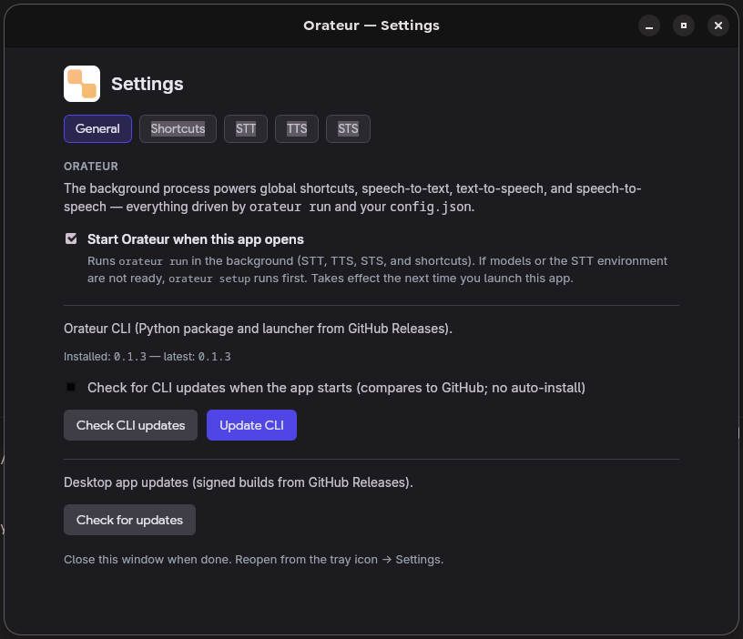
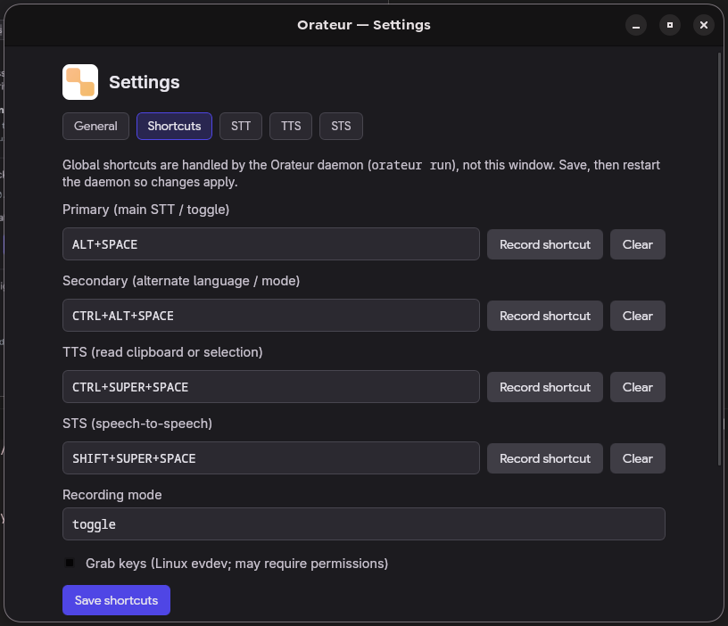
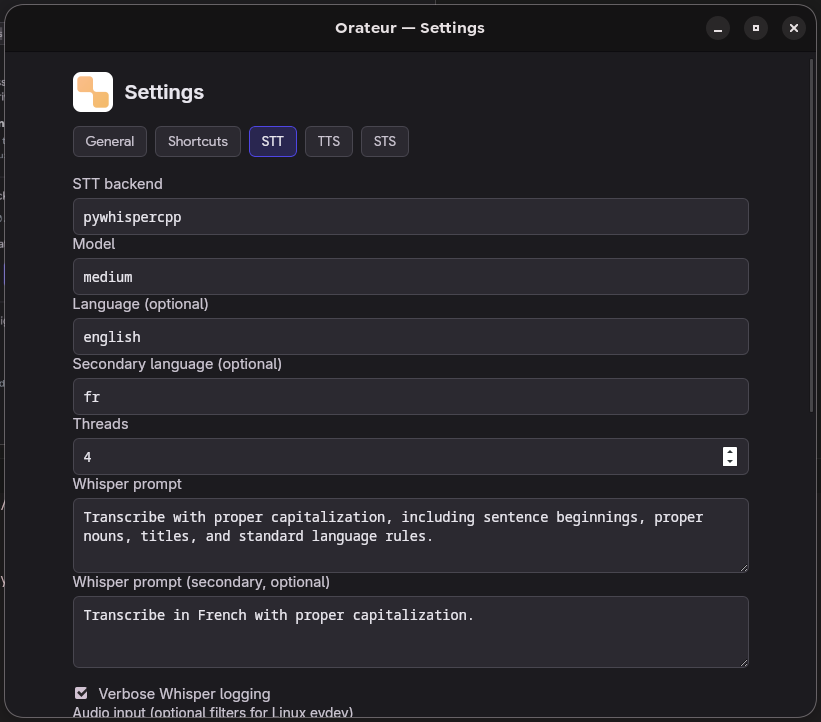
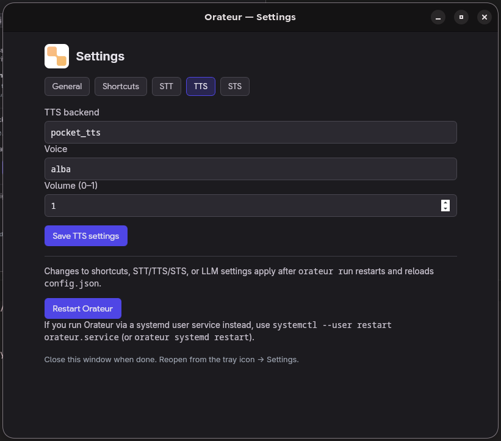
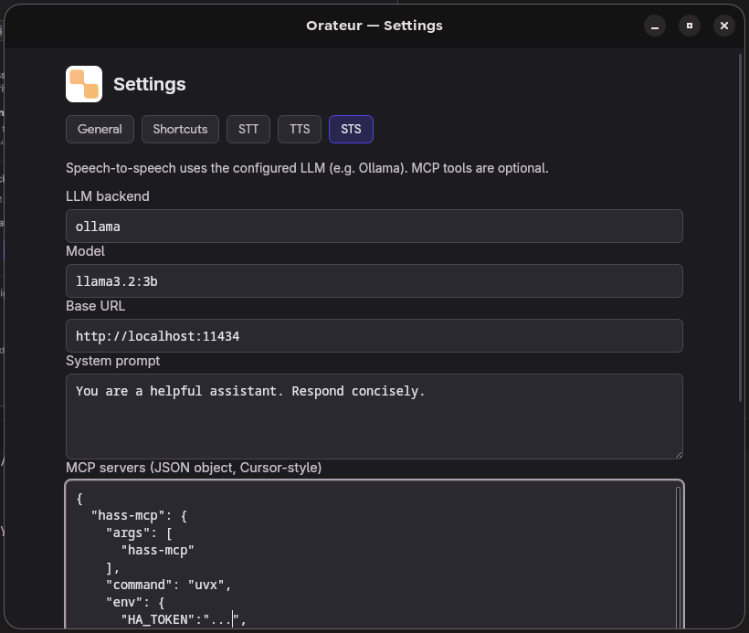

# Orateur

Local **speech-to-text** (Whisper), **text-to-speech** (Pocket TTS), and **speech-to-speech** (STT → Ollama → TTS), with optional **MCP tools**, **global shortcuts**, and a **status UI** (Quickshell panel or [Tauri desktop](desktop/) overlay).

**Python 3.10+** is required; the `orateur` launcher refuses older interpreters.

**Documentation:** [orateurhq.github.io/orateur](https://orateurhq.github.io/orateur/) (MkDocs — `uv sync --dev` then `uv run mkdocs serve`). High-level architecture: [`diagram.png`](diagram.png) in the repo root.

---

## Screenshots

Settings from the **desktop app** (paths under `docs/screenshots/`). The same gallery appears on the [documentation site](https://orateurhq.github.io/orateur/).

| General | Shortcuts |
| :-----: | :-------: |
|  |  |

| Speech-to-text | Text-to-speech |
| :------------: | :------------: |
|  |  |

| Speech-to-speech |
| :--------------: |
|  |

---

## Features

- **STT** — Whisper via pywhispercpp
- **TTS** — Pocket TTS
- **STS** — Speech-to-speech through a local LLM (e.g. Ollama)
- **MCP** — Tool servers exposed to the model (stdio + optional SSE)
- **Shortcuts** — Global hotkeys (Linux: evdev; macOS/Windows: pynput)
- **Systemd** — Optional user service with models loaded once
- **UI** — Quickshell bar and/or Tauri overlay, driven by `~/.cache/orateur/ui_events.jsonl`

---

## Install

You need **`pip`**, **`python3 -m venv`**, and a system Python **≥ 3.10**. On Debian/Ubuntu, install **`python3-venv`** if `venv` is missing.

### Release installer (recommended)

Each [GitHub release](https://github.com/orateurhq/orateur/releases) ships **`install.sh`**, a wheel, **`quickshell-orateur.tar.gz`**, and the **`bin/orateur`** launcher. The script installs into **`~/.local/share/orateur/venv`**, puts **`orateur`** in **`~/.local/bin`** (override with **`ORATEUR_BIN_DIR`**), and unpacks Quickshell assets.

```bash
curl -fsSL https://github.com/orateurhq/orateur/releases/latest/download/install.sh | bash
```

If **`latest` is unavailable**, use a concrete tag (see [releases](https://github.com/orateurhq/orateur/releases)):

```bash
curl -fsSL https://github.com/orateurhq/orateur/releases/download/v0.1.3/install.sh | bash
```

From a repo checkout you can instead run [`scripts/install.sh`](scripts/install.sh) with a version or **`ORATEUR_VERSION`**.

Ensure **`~/.local/bin`** is on **`PATH`**, then:

```bash
orateur setup    # models, optional GPU STT, Quickshell panel, …
orateur run      # main loop (also what systemd uses)
```

The [Tauri app](desktop/) uses the same install flow on macOS/Linux (bundled wheel optional). **Windows** currently uses **`pip install --user`** until a native installer exists.

### Distro packages

If your package manager installs `orateur`, run **`orateur setup`** once, then **`orateur run`**.

### Development ([uv](https://docs.astral.sh/uv/))

```bash
git clone https://github.com/orateurhq/orateur.git
cd orateur
uv sync
uv run orateur setup
uv run orateur run
```

---

## Usage

| Command | Role |
|--------|------|
| `orateur run` | Main loop (shortcuts, STS, UI events); use with **systemd** for a headless session |
| `orateur transcribe` | Transcribe from the mic |
| `orateur sts` | Speech-to-speech |
| `orateur speak` | TTS from the current selection |
| `orateur config init` / `show` | Config under **`~/.config/orateur/config.json`** |

Use **`uv run orateur …`** in a development tree.

---

## GPU acceleration (CUDA / Metal)

Default pywhispercpp wheels are CPU-only. **`orateur setup`** can build from source when a GPU stack is present:

- **Linux + NVIDIA** — CUDA if `nvcc` / `nvidia-smi` indicate a toolkit
- **Apple Silicon** — Metal
- **Otherwise** — CPU wheel from PyPI

```bash
orateur setup --backend auto    # default
orateur setup --backend nvidia  # Linux, CUDA required
orateur setup --backend metal   # Apple Silicon
orateur setup --backend cpu     # PyPI CPU wheel
orateur setup --force           # reinstall STT stack
```

GPU builds can take several minutes. On macOS, Xcode Command Line Tools are required.

---

## Quickshell panel

If [Quickshell](https://quickshell.org/) is installed, **`orateur setup`** installs **`~/.config/quickshell/orateur/`** and can write **`orateur_bin_path`** for minimal-`PATH` environments.

```bash
quickshell -c orateur
```

**`orateur run`** appends one JSON object per line to **`~/.cache/orateur/ui_events.jsonl`**; the panel uses **`tail -F`** on that file, so no second Orateur process is needed for the UI.

- **`quickshell_autostart`** in **`config.json`** — spawn **`quickshell -c orateur`** from **`orateur run`**
- **`ui_events_mirror`** — set to **`false`** to stop writing **`ui_events.jsonl`** (disables external UIs)
- **Hyprland / multiple monitors** — the bar follows the focused output when Hyprland integration is available

**Experimental:** cross-platform overlay in **`desktop/`** (same JSONL). See **`desktop/README.md`**.

---

## Systemd (user service)

Run **`orateur run`** in the background so shortcuts work without a terminal:

```bash
orateur systemd install    # writes ~/.config/systemd/user/orateur.service, enable + start
orateur systemd status
orateur systemd restart
```

The unit is **`WantedBy=graphical-session.target`** (starts with your graphical session, not at firmware boot). If **`quickshell`** is missing from the service **`PATH`**, add a drop-in with **`systemctl --user edit orateur.service`**.

Desktop notifications on ready/shutdown use **`notify-send`** (disable via **`desktop_notifications`** or **`ORATEUR_NO_NOTIFY=1`**).

---

## Configuration & MCP

- **Config file:** **`~/.config/orateur/config.json`** — **`orateur config init`** / **`orateur config show`**
- **MCP:** define **`mcpServers`** (stdio) and optionally **`mcp_tools_url`** (SSE); list with **`orateur mcp list`**

Example:

```json
{
  "mcpServers": {
    "example": { "command": "uvx", "args": ["some-mcp-server"] }
  }
}
```

The deprecated key **`quickshell_ui_mirror`** is migrated once to **`ui_events_mirror`**.

---

## Stopping

- **Ctrl+C** in the terminal running **`orateur run`**
- **Systemd:** **`systemctl --user stop orateur.service`** or **`orateur systemd restart`** after config changes
- If needed: **`pkill -f "orateur run"`** (avoid killing unrelated processes)

---

## Releasing (maintainers)

Releases are **only** driven by **[Semantic Release](.github/workflows/semantic_release.yml)** on push to **`main`**: after verify passes, it bumps the version from [conventional commits](https://www.conventionalcommits.org/), runs [`scripts/sync_version_for_release.py`](scripts/sync_version_for_release.py) and the build in [`pyproject.toml`](pyproject.toml) (`[tool.semantic_release]`), publishes the GitHub release, and uploads the wheel, sdist, **`install.sh`**, Quickshell tarball, and launcher. Configuration lives under **`[tool.semantic_release]`** in **`pyproject.toml`**.

For a one-off version sync in a branch (without cutting a release yourself), you can still run **`python3 scripts/sync_version_for_release.py <semver>`** then **`uv lock`** and commit; the automated release will apply the same steps when it runs.
