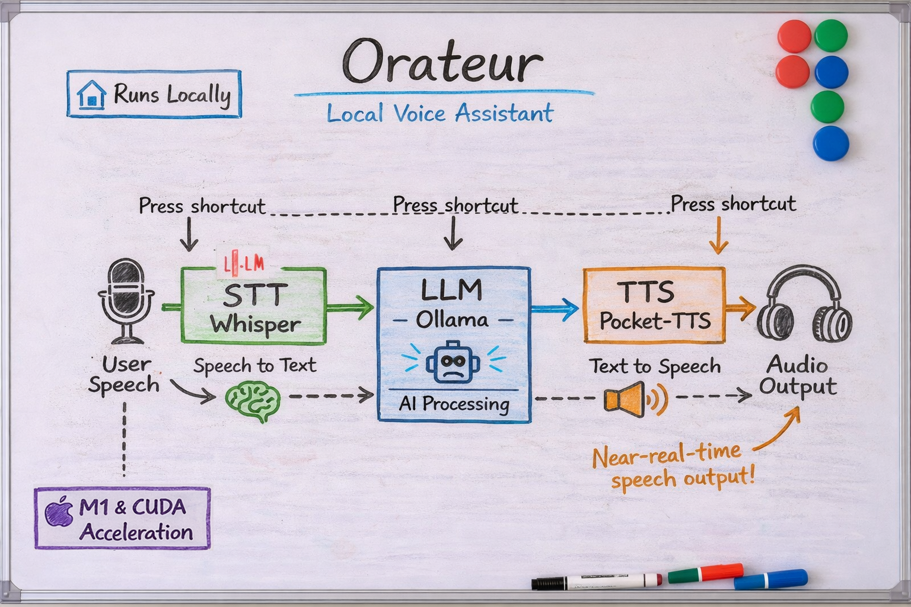

# Orateur

Minimal python local speech-to-text, text-to-speech and speech-to-speech assistant.

**Requirements:** Python **3.10 or newer**. The `orateur` launcher checks this and exits with an error if the interpreter is too old.



## Features

- **STT**: Whisper (pywhispercpp) for transcription
- **TTS**: Pocket TTS for text-to-speech
- **STS**: Speech-to-Speech (STT → Ollama/LLM → TTS)
- **MCP**: Tool providers via Model Context Protocol (Ollama uses them as function tools)
- **Shortcuts**: Global keyboard shortcuts (evdev)
- **Systemd**: Background service with pre-loaded models
- **Quickshell**: Panel widget with recording/TTS preview, waveform, and duration estimate

## Installation

Use a system Python that satisfies **3.10+** (the venv created by `orateur setup` uses that interpreter).

### From package manager (no uv required)

When installed via your distro (e.g. AUR), run setup once to create the venv and install GPU support:

```bash
orateur setup
```

### Development (with uv)

```bash
cd orateur
uv sync
```

## GPU acceleration (NVIDIA CUDA or Apple Metal)

The default `pywhispercpp` wheel from PyPI is CPU-only. Run setup to build from source with a GPU backend where supported:

```bash
# Installed users
orateur setup

# Development
uv run orateur setup
```

- **Linux x86_64 + CUDA** (detected via `nvcc` or `nvidia-smi`): builds with CUDA.
- **macOS Apple Silicon (arm64)**: builds with Metal (Apple GPU).
- **Otherwise**: installs the CPU wheel from PyPI.

CUDA is not available on macOS; Metal is not used on Linux. Options:

```bash
orateur setup --backend auto   # default: CUDA on Linux+GPU, Metal on Apple Silicon, else CPU wheel
orateur setup --backend nvidia # force CUDA build (Linux only; fails if no CUDA)
orateur setup --backend metal  # force Metal build (Apple Silicon only)
orateur setup --backend cpu    # PyPI CPU only
orateur setup --build-from-source  # force editable build: CUDA (Linux) or Metal (Apple Silicon)
orateur setup --force          # reinstall even if already installed
```

Setup skips installation when pywhispercpp is already installed with the correct backend. Use `--force` to reinstall.

GPU builds can take several minutes (Xcode Command Line Tools are required on macOS).

`setup` passes `pip install --break-system-packages` only when installing into the active venv (needed for **uv**-managed Python environments that enforce PEP 668).

The **`bin/orateur`** launcher uses the **project `.venv`** when it exists (same as `uv run`), otherwise `~/.local/share/orateur/venv`. Run **setup** and **run** with the same venv (or reinstall after changing workflows).

## Usage

```bash
# Run main loop (used by systemd)
orateur run

# Transcribe
orateur transcribe

# Speech-to-Speech
orateur sts

# TTS from selection
orateur speak
```

For development, prefix with `uv run`:

```bash
uv run orateur run
uv run orateur transcribe
```

### Quickshell

If [Quickshell](https://quickshell.org/) is installed, `orateur setup` installs the panel under **`~/.config/quickshell/orateur/`** and writes **`~/.config/quickshell/orateur_bin_path`** (handy if you run **`orateur ui`** or **`orateur`** from scripts where `PATH` is minimal).

```bash
orateur setup          # refresh panel + launcher path file
quickshell -c orateur
```

**How the bar gets events:** **`orateur run`** (including systemd) appends one JSON object per line to **`~/.cache/orateur/ui_events.jsonl`**. The panel runs **`tail -n0 -F`** on that file, so **no second Orateur process** is needed for the UI. Whisper/TTS load **once** in the service.

Restart **`orateur`** after upgrading so the JSONL file is recreated; restart **Quickshell** after changing the panel QML. You need **`tail`** in `PATH` (standard on Linux).

The panel shows recording/TTS preview with waveform and duration estimate.

**Tauri overlay (experimental):** a cross-platform window that reads the same JSONL file is in **`desktop/`**. See **`desktop/README.md`**.

**Multiple monitors (Hyprland):** The bar uses a single layer surface on the **focused** Hyprland output (`import Quickshell.Hyprland`). When focus moves to another monitor, the panel follows. Your Quickshell package must include Hyprland integration (typical on Arch/AUR). On a single screen, or if Hyprland cannot match outputs, the first Quickshell screen is used.

**FIFO / `orateur ui` (optional):** To drive recording from **`orateur ui-send`** instead of shortcuts, run **`orateur ui`** or **`orateur ui --events-only`** in a terminal; it uses **`~/.cache/orateur/cmd.fifo`**. That path is separate from **`ui_events.jsonl`**.

**With `orateur run` (e.g. systemd):** **`ui_events_mirror`** (default **`true`**) controls writing **`ui_events.jsonl`**. Set it to **`false`** to disable external UI updates (Quickshell panel, Tauri overlay, etc.).

**Auto-start the panel:** set **`quickshell_autostart`** to **`true`** in **`config.json`**. Then **`orateur run`** spawns **`quickshell -c orateur`** after shortcuts are ready and stops it on exit. Leave **`false`** (default) if you launch Quickshell yourself or use another shell integration, to avoid two instances.

### Systemd (user service)

Run the shortcut loop (`orateur run`) in the background so global shortcuts work without a terminal.

**Install, enable, and start** — from a git checkout the service uses the repo launcher (`./bin/orateur run`); if only `orateur` is on your `PATH` (e.g. distro package), `ExecStart` is `orateur run`:

```bash
orateur systemd install
```

This writes `~/.config/systemd/user/orateur.service`, reloads systemd, enables the unit for your user session, and starts it.

**Desktop notifications:** when **`orateur run`** is ready (shortcuts active), a low-urgency notification is sent; another when the process shuts down. This uses **`notify-send`** (install **`libnotify`** on Arch). Set **`desktop_notifications`** to **`false`** in **`config.json`**, or **`ORATEUR_NO_NOTIFY=1`** in the environment, to disable.

**Start when you log in (typical “at boot”):** the unit is **`WantedBy=graphical-session.target`**, so it starts with your **user** session once a graphical session exists (after login to Hyprland, KDE, etc.). It does **not** run at firmware boot before login. After `orateur systemd install`, it stays enabled across reboots; verify with:

```bash
systemctl --user is-enabled orateur.service
```

**PATH and Wayland:** user services sometimes have a minimal **`PATH`**. If **`quickshell_autostart`** fails with “not found”, add a drop-in (example paths—adjust for your install):

```bash
systemctl --user edit orateur.service
```

```ini
[Service]
Environment=PATH=/usr/local/bin:/usr/bin:/bin
```

Then **`systemctl --user daemon-reload`** and **`orateur systemd restart`**.

**Check status** or **restart** after config changes:

```bash
orateur systemd status
orateur systemd restart
```

The unit is ordered after **PipeWire** and **graphical-session** so audio and your GUI session are up. Run **`orateur setup`** (or equivalent) so STT/TTS are ready, and keep **`~/.config/orateur/config.json`** in order.

**Quickshell:** run **`quickshell -c orateur`** yourself, or set **`quickshell_autostart`** so **`orateur run`** starts it (see above). With **`ui_events_mirror`** enabled (default), the service and any UI that tails **`ui_events.jsonl`** stay in sync when both run.

**Development** (`uv`):

```bash
uv run orateur systemd install
```

Optional: set **`ORATEUR_ROOT`** to the repository root if the install command should resolve `config/orateur.service` from a specific path.

## Configuration

Config: `~/.config/orateur/config.json`

```bash
orateur config init
orateur config show
```

### UI events mirroring

| Key | Default | Meaning |
|-----|---------|---------|
| `ui_events_mirror` | `true` | `orateur run` appends UI events to **`~/.cache/orateur/ui_events.jsonl`** for any client (Quickshell `tail -F`, Tauri **`desktop/`**, scripts). |
| `quickshell_autostart` | `false` | If **`true`**, `orateur run` runs **`quickshell -c orateur`** as a child process and stops it on shutdown. |

The deprecated key **`quickshell_ui_mirror`** is still read once on load and migrated to **`ui_events_mirror`**, then removed from the in-memory config.

### MCP tools (Ollama)

MCP servers provide tools that Ollama can call during STS. Define them in `mcpServers` (stdio) and optionally `mcp_tools_url` (SSE). All tools are passed to the LLM; when it returns tool calls, they are executed via MCP and the results fed back.

```json
{
  "mcpServers": {
    "weather-forecast": {
      "command": "uvx",
      "args": ["weather-forecast-server"]
    }
  },
  "mcp_tools_url": "http://localhost:8050/sse"
}
```

- **mcpServers**: Named stdio servers with `command` and `args` (Cursor-compatible)
- **mcp_tools_url**: Optional SSE URL for an MCP tool server

List configured servers with `orateur mcp list`.

## Stopping

- **Ctrl+C** in the terminal stops `orateur run`
- **Systemd**: `systemctl --user stop orateur.service` (or `orateur systemd restart` after edits)
- If `kill <pid>` doesn't work: kill the Python process (the one with higher memory in `ps aux`), or use `pkill -f "orateur run"` to stop all
